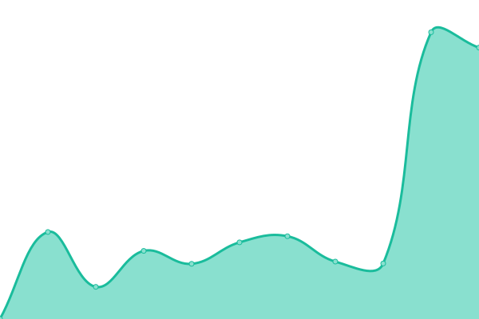

# [📈 Live Status](https://status.0121.org): <!--live status--> **🟧 Partial outage**

This repository contains the open-source uptime monitor and status page for [0121.org](https://status.0121.org), powered by [Upptime](https://github.com/upptime/upptime).

With [Upptime](https://upptime.js.org), you can get your own unlimited and free uptime monitor and status page, powered entirely by a GitHub repository. We use [Issues](https://github.com/012101do1/upptime/issues) as incident reports, [Actions](https://github.com/012101do1/upptime/actions) as uptime monitors, and [Pages](https://status.0121.org) for the status page.

<!--start: status pages-->
<!-- This summary is generated by Upptime (https://github.com/upptime/upptime) -->
<!-- Do not edit this manually, your changes will be overwritten -->
<!-- prettier-ignore -->
| URL | Status | History | Response Time | Uptime |
| --- | ------ | ------- | ------------- | ------ |
|  [0121.org](https://0121.org) | 🟩 Up | [0121-org.yml](https://github.com/012101do1/upptime/commits/HEAD/history/0121-org.yml) | 

 1319ms
     
 | 

<a href="https://status.0121.org/history/0121-org">99.66%</a>
    

|  [Jellyfin](https://jellyfin.0121.org) | 🟩 Up | [jellyfin.yml](https://github.com/012101do1/upptime/commits/HEAD/history/jellyfin.yml) | 

 935ms
     
 | 

<a href="https://status.0121.org/history/jellyfin">97.22%</a>
    

|  [Ombi](https://ombi.0121.org) | 🟩 Up | [ombi.yml](https://github.com/012101do1/upptime/commits/HEAD/history/ombi.yml) | 

 1843ms
     
 | 

<a href="https://status.0121.org/history/ombi">98.04%</a>
    

|  [Nextcloud](https://nextcloud.0121.org) | 🟥 Down | [nextcloud.yml](https://github.com/012101do1/upptime/commits/HEAD/history/nextcloud.yml) | 

 2340ms
     
 | 

<a href="https://status.0121.org/history/nextcloud">97.51%</a>
    

|  [Pterodactyl](https://pterodactyl.0121.org) | 🟩 Up | [pterodactyl.yml](https://github.com/012101do1/upptime/commits/HEAD/history/pterodactyl.yml) | 

 2237ms
     
 | 

<a href="https://status.0121.org/history/pterodactyl">92.56%</a>
    

<!--end: status pages-->

[**Visit our status website →**](https://status.0121.org)

## 📄 License

- Powered by: [Upptime](https://github.com/upptime/upptime)
- Code: [MIT](./LICENSE) © [012101do1](https://status.0121.org)
- Data in the `./history` directory: [Open Database License](https://opendatacommons.org/licenses/odbl/1-0/)
